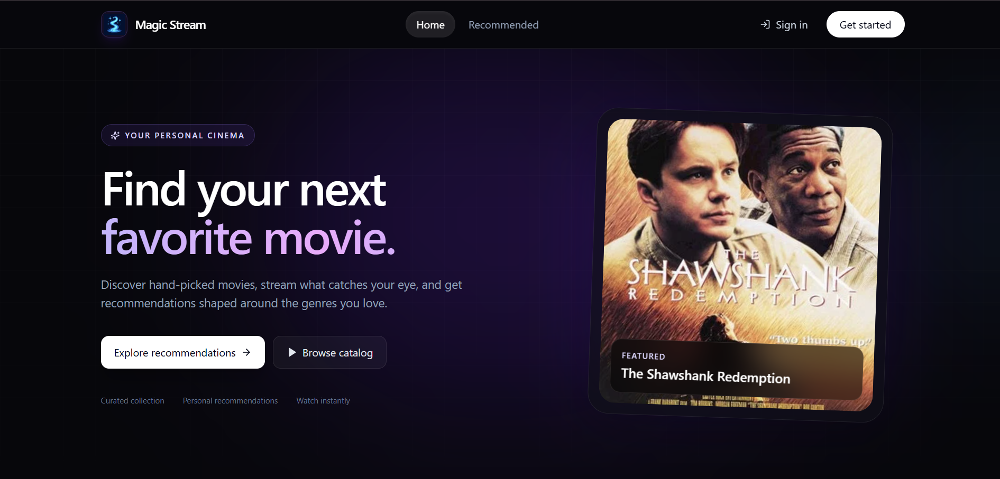
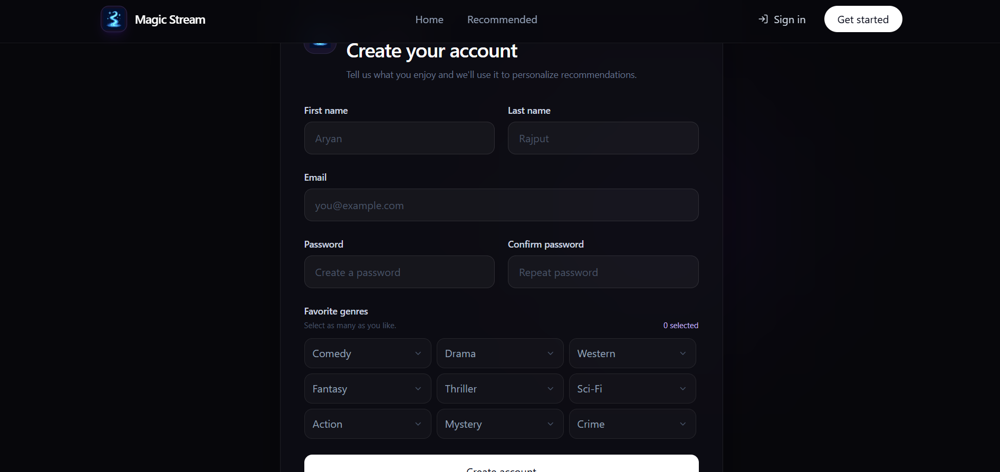
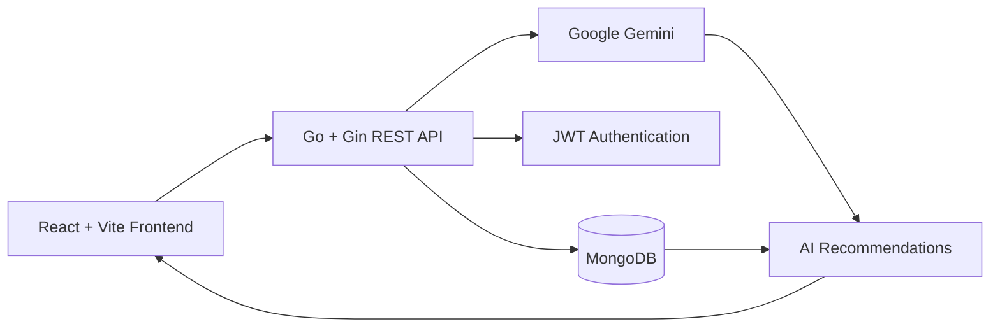
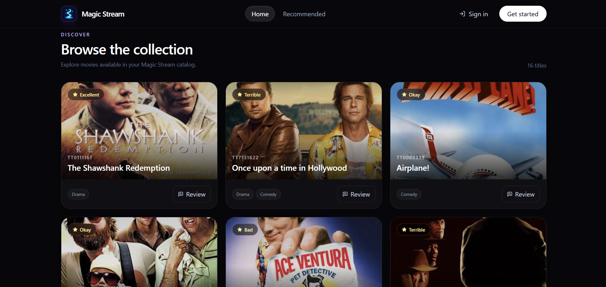
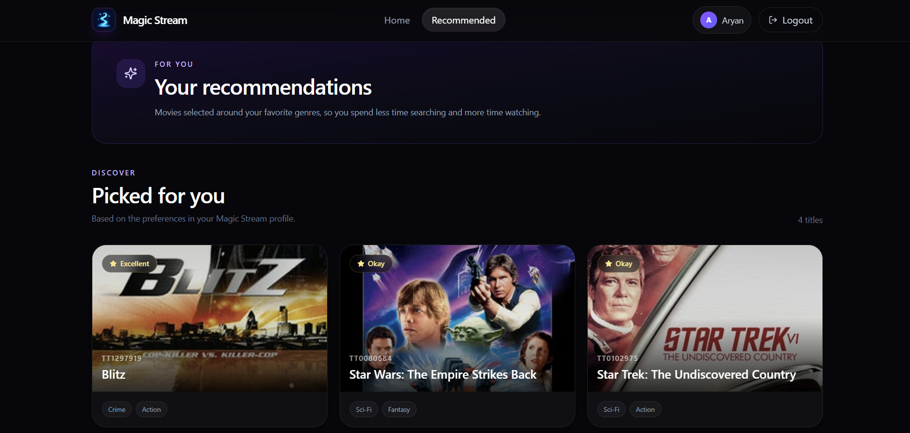

# MovieStream

An AI-powered movie streaming and recommendation platform built with **React.js, Go, Gin, MongoDB, JWT, and Google Gemini**. MovieStream allows users to discover movies, create accounts, manage reviews and ratings, and receive AI-powered movie recommendations.



## ✨ Features

- 🎬 Browse and discover movies
- 🤖 AI-powered movie recommendations using Google Gemini
- 🔐 Secure user authentication using JWT
- 👤 User registration and login
- ⭐ Rate and review movies
- 💬 Create and manage movie reviews
- 🎯 Personalized movie recommendations
- 🔎 Search and explore movies
- 🗄️ MongoDB-based data persistence
- ⚡ RESTful API built with Go and Gin
- 🌐 Modern frontend built with React and Vite
- 🛡️ Protected API routes using JWT middleware
- 🔑 Environment-based configuration for secrets and API keys

## 🏗️ Architecture





## 🔄 Application Flow



```text
User
  ↓
React + Vite Frontend
  ↓
Axios API Requests
  ↓
Go + Gin REST API
  ↓
JWT Authentication
  ↓
MongoDB
  ↓
Google Gemini
  ↓
AI Recommendations
  ↓
React UI
```

## 🛠️ Tech Stack



### Frontend

- **React.js**
- **Vite**
- **JavaScript**
- **Tailwind CSS**
- **Axios**
- **React Router**

### Backend

- **Go**
- **Gin Gonic**
- **MongoDB**
- **MongoDB Go Driver**
- **JWT**
- **REST API**

### AI

- **Google Gemini**
- **LangChainGo**
- Generative AI for movie recommendations and insights

### Database

- **MongoDB**
- **MongoDB Atlas**

### Deployment

- **Vercel** → Frontend
- **Render** → Backend
- **MongoDB Atlas** → Database
- **Google Gemini API** → AI services

## 🚀 Setup

### 1. Clone the Repository

```bash
git clone https://github.com/aryanraj13/MovieStream.git
cd MovieStream
```

---

## 🖥️ Backend Setup

### 2. Navigate to the Backend

```bash
cd Server/MovieStreamServer
```

### 3. Install Dependencies

```bash
go mod tidy
```

### 4. Create Environment Variables

Create a `.env` file inside the backend directory:

```env
MONGO_URI=your_mongodb_connection_string
JWT_SECRET=your_jwt_secret
GOOGLE_API_KEY=your_gemini_api_key
```

### 5. Run the Backend

```bash
go run main.go
```

The backend server will run on:

```text
http://localhost:8080
```

---

## 🌐 Frontend Setup

### 6. Navigate to the Frontend

Open a new terminal:

```bash
cd Client/movie-stream-client
```

### 7. Install Dependencies

```bash
npm install
```

### 8. Create Environment Variables

Create a `.env` file inside the frontend directory:

```env
VITE_API_BASE_URL=http://localhost:8080
```

### 9. Start the Development Server

```bash
npm run dev
```

The frontend will be available at:

```text
http://localhost:5173
```

## 🤖 AI Features

MovieStream integrates **Google Gemini** to provide AI-powered functionality.

The AI layer is designed to support:

- 🎯 Personalized movie recommendations
- 🎬 Movie analysis
- 🧠 Understanding user preferences
- 💡 Movie-related insights
- 🔎 Recommendation generation based on movie information

The Gemini API key is configured using an environment variable:

```env
GOOGLE_API_KEY=your_gemini_api_key
```

The API key should never be exposed in the frontend or committed to GitHub.

## 🔐 Authentication

MovieStream uses **JSON Web Tokens (JWT)** for authentication and authorization.

### Authentication Flow

```text
User Registration
       ↓
User Login
       ↓
Credentials Validated
       ↓
JWT Token Generated
       ↓
Token Sent to Client
       ↓
Authenticated API Request
       ↓
JWT Middleware
       ↓
Protected Controller
       ↓
Response
```

Protected API endpoints require a valid JWT token.

## 🗄️ Database

MovieStream uses **MongoDB** for persistent application data.

MongoDB stores information such as:

- Users
- Movies
- Reviews
- Ratings
- User preferences
- Recommendation-related data

For production, the application can use **MongoDB Atlas**.

## ⚙️ Configuration

### Frontend Configuration

The frontend API URL is configured through:

```text
Client/movie-stream-client/.env
```

```env
VITE_API_BASE_URL=http://localhost:8080
```

Axios uses this environment variable to communicate with the backend API.

### Backend Configuration

Backend configuration is stored through environment variables:

```text
Server/MovieStreamServer/.env
```

```env
MONGO_URI=your_mongodb_connection_string
JWT_SECRET=your_jwt_secret
GOOGLE_API_KEY=your_gemini_api_key
```

## 🔌 API Architecture

The backend follows a RESTful architecture using **Gin Gonic**.

```text
HTTP Request
     ↓
Gin Router
     ↓
Middleware
     ↓
Controller
     ↓
Database / AI Service
     ↓
JSON Response
```

The backend is organized into separate layers for:

- Routes
- Controllers
- Models
- Middleware
- Database
- Utilities
- AI services

## 📁 Project Structure

```text
MovieStream/
│
├── Client/
│   └── movie-stream-client/
│       ├── src/
│       │   ├── components/       # Reusable React components
│       │   ├── pages/            # Application pages
│       │   ├── services/         # API and Axios configuration
│       │   ├── context/          # Application state
│       │   └── App.jsx
│       │
│       ├── public/
│       ├── package.json
│       └── vite.config.js
│
├── Server/
│   └── MovieStreamServer/
│       ├── controllers/          # API controllers
│       ├── database/             # MongoDB connection
│       ├── models/               # Database models
│       ├── routes/               # API routes
│       ├── middleware/           # Authentication middleware
│       ├── utils/                # JWT and utility functions
│       ├── main.go               # Server entry point
│       ├── go.mod
│       └── go.sum
│
├── .gitignore
└── README.md
```

## ☁️ Deployment

MovieStream can be deployed using:

```text
Frontend
   ↓
Vercel
   ↓
React + Vite Application

Backend
   ↓
Render
   ↓
Go + Gin REST API

Database
   ↓
MongoDB Atlas
   ↓
Application Data

AI
   ↓
Google Gemini API
   ↓
AI Recommendations
```

### Production Environment Variables

Configure the following environment variables on the deployment platforms:

#### Backend

```env
MONGO_URI=your_production_mongodb_uri
JWT_SECRET=your_production_jwt_secret
GOOGLE_API_KEY=your_gemini_api_key
```

#### Frontend

```env
VITE_API_BASE_URL=your_production_backend_url
```

Never commit production credentials to the repository.

## 🔐 Security

Never commit `.env` files, API keys, database credentials, or JWT secrets.

Add the following to `.gitignore`:

```gitignore
.env
.env.*
node_modules/
.venv/
__pycache__/
*.log
```

If a secret is accidentally pushed to GitHub, revoke and regenerate it immediately.

## 🧪 Development

### Backend

Run the Go server:

```bash
go run main.go
```

### Frontend

Run the Vite development server:

```bash
npm run dev
```

### Build Frontend

```bash
npm run build
```

### Preview Production Build

```bash
npm run preview
```

## 🚀 Future Improvements

- 🎥 Video streaming integration
- 🧠 Advanced personalized recommendation system
- 💬 AI-powered movie chatbot
- 📊 Recommendation history
- 🔍 Semantic movie search using embeddings
- ⚡ Recommendation caching
- 📱 Improved mobile experience
- 🧪 Automated frontend and backend testing
- 📈 User recommendation analytics
- 🎭 More detailed movie personalization
- 🔄 Real-time movie data integration

## 🎯 Project Highlights

MovieStream demonstrates the integration of **Generative AI with a full-stack application**.

Key engineering concepts demonstrated:

- Full-stack application development
- REST API design
- Go backend development
- Gin web framework
- MongoDB database integration
- JWT authentication
- Protected API routes
- React component architecture
- API integration with Axios
- Environment-based configuration
- Generative AI integration
- Personalized recommendations
- Cloud deployment

## 👨‍💻 Author

**Aryan Rajput**

Built as an AI-powered full-stack project combining:

**React.js + Go + Gin + MongoDB + JWT + Google Gemini**
```